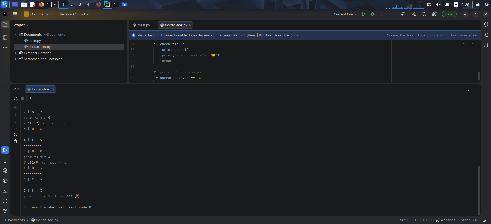
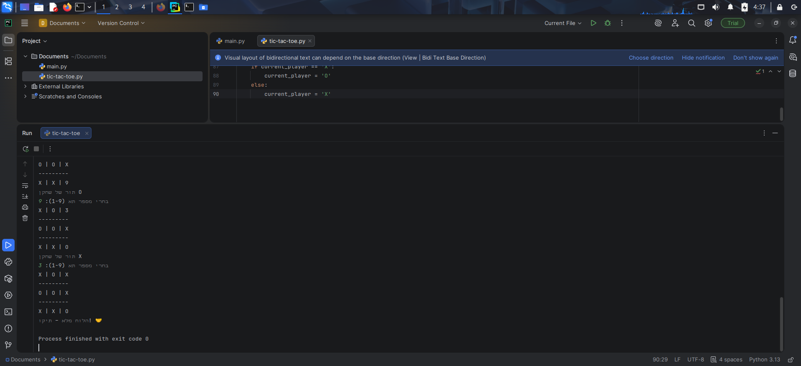

# משחק איקס עיגול ראשון שלי בפייתון 🎉
  
בניתי משחק איקס עיגול שלם בקונסולה בעזרת הדרכה שלב אחר שלב עם AI בסדנה להיכרות עם Python לנשים.

המשחק כולל:
- לוח דינמי
- בדיקת תקינות קלט (לא נותן לשחק על תא תפוס או מחוץ ללוח)
- זיהוי ניצחון בשורות, עמודות ושני האלכסונים
- זיהוי תיקו כשהלוח מלא

החוויה הייתה מדהימה – גיליתי כמה קל ומהנה ללמוד קוד כשמישהו מלווה אותך צעד צעד.  
זה נתן לי טעם של עוד ומוטיבציה להמשיך ללמוד תכנות! 🚀

## צילומי מסך

תודה ענקית ליובל פונדק מינץ על הסדנה המעולה! ❤️
